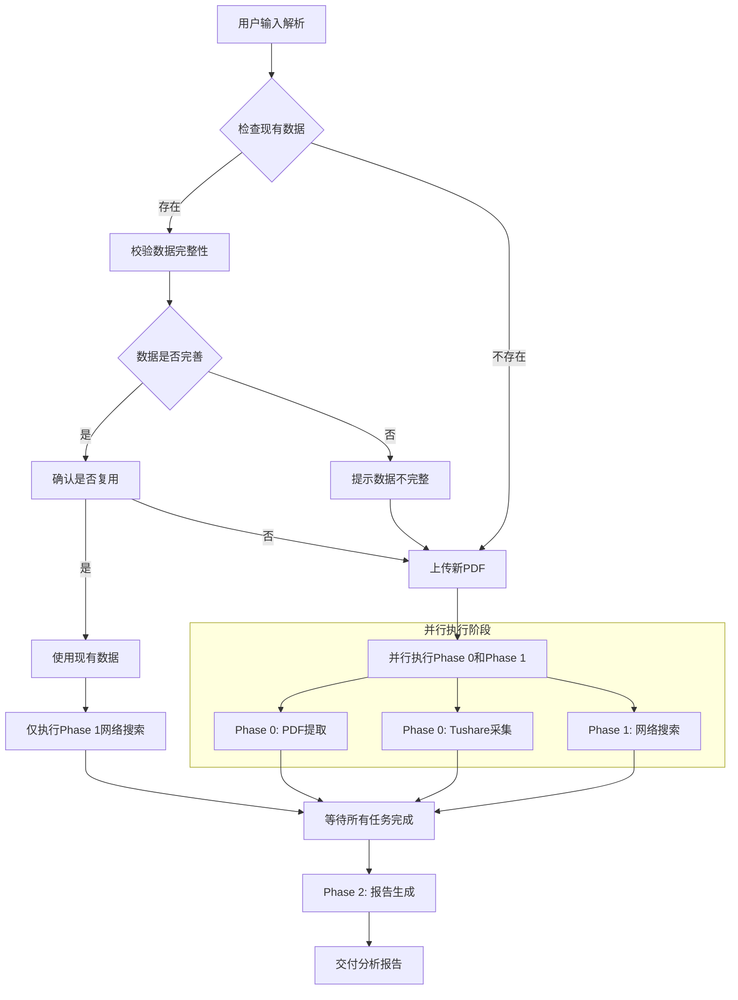

# 龟龟投资策略 v2.0 — 增强协调器（Coordinator）

> 本文件为多阶段分析的调度中枢，专为大模型设计。协调器负责调度三阶段分析流程：
>
> - **Phase 0**：数据采集（PDF提取 + Tushare财务数据，并行执行）
> - **Phase 1**：网络搜索（补充第三方信息，并行执行）
> - **Phase 2**：报告生成（整合所有数据，输出分析报告）

***

## 脚本工具总览

| 脚本                          | 用途                                          | 推荐度     |
| --------------------------- | ------------------------------------------- | ------- |
| `turtle_analysis.py`        | **一键执行数据采集**（PDF提取 + Tushare采集），支持断点续传、并行提取 | ⭐⭐⭐ 推荐  |
| `pdf_parallel_extractor.py` | 多进程PDF章节提取，支持增量提取、缓存机制                      | ⭐⭐⭐ 高性能 |
| `tushare_collector.py`      | Tushare财务数据采集                               | ⭐⭐ 基础工具 |
| `pdf_preprocessor.py`       | 基础PDF提取（顺序处理）                               | ⭐ 兼容模式  |
| `data_validator.py`         | 数据校验（PDF vs Tushare交叉验证）                    | ⭐⭐ 校验工具 |
| `config_loader.py`          | 统一配置加载（读取config.yaml）                       | 基础模块    |
| `task_status.py`            | 任务状态管理（断点续传支持）                              | 基础模块    |

**快速开始**：

```bash
# 一键执行数据采集（推荐）
python scripts/turtle_analysis.py --code 600989.SH --pdf /path/to/report.pdf

# 从断点恢复
python scripts/turtle_analysis.py --code 600989.SH --resume

# 查看任务状态
python scripts/turtle_analysis.py --code 600989.SH --status
```

***

## 核心工作流程



**关键优化**：

- **Phase 0 和 Phase 1 并行执行**：数据采集（PDF提取 + Tushare）和网络搜索同时进行，提升效率
- **等待机制**：所有并行任务完成后，才进入 Phase 2 报告生成阶段
- **复用场景优化**：若用户选择复用现有数据，仅需执行 Phase 1 网络搜索

***

## 并行执行策略

### 为什么并行执行？

**Phase 0（数据采集）和Phase 1（网络搜索）互不依赖**，可以同时执行：

| 阶段      | 任务                | 依赖项 | 输出                                          |
| ------- | ----------------- | --- | ------------------------------------------- |
| Phase 0 | PDF提取 + Tushare采集 | 无   | `data_pack_market.md` + `pdf_sections.json` |
| Phase 1 | 网络搜索              | 无   | `web_search_result.md`                      |

**并行优势**：

- 减少总执行时间约40-50%
- 网络搜索和API调用可同时进行
- 用户等待时间更短

### 并行执行方式

**方式一：大模型内部并行**

- 在同一响应中同时执行多个搜索和数据提取任务
- 适用于：网络搜索、PDF文本提取

**方式二：脚本并行执行**

```bash
# 终端1：数据采集（Phase 0）
python scripts/turtle_analysis.py --code 600989.SH --pdf {PDF路径}

# 终端2：网络搜索（Phase 1）- 由大模型执行
# 大模型同时进行网络搜索
```

**方式三：复用现有数据时**

- 若用户选择复用现有数据，跳过Phase 0
- 仅执行Phase 1（网络搜索）

***

## 前置步骤：输入解析与数据检查

### 步骤1：输入解析

**用户输入可能包含以下组合**：

| 输入项      | 示例                                   | 必需？ |
| -------- | ------------------------------------ | --- |
| 股票代码或名称  | `600989` / `宝丰能源` / `0001.HK` / `长和` | 必需  |
| 持股渠道     | `港股通` / `直接` / `美股券商`                | 可选  |
| PDF 年报文件 | 用户上传的 `.pdf` 文件或本地路径                 | 可选  |

**解析规则**：

1. 从用户消息中提取股票代码/名称和持股渠道
2. 检查是否有 PDF 文件上传或本地路径
3. 若用户只给了公司名称没给代码，通过 Tushare `stock_basic` 确认代码
4. 股票代码格式化：A 股 → `XXXXXX.SH` 或 `XXXXXX.SZ`；港股 → `XXXXX.HK`

**解析结果示例**：

| 项目   | 值                              |
| ---- | ------------------------------ |
| 股票代码 | 600989.SH                      |
| 公司名称 | 宝丰能源                           |
| 报告年份 | 2025                           |
| 报告期  | 年报                             |
| 输出目录 | output/600989SH\_宝丰能源/2025\_年报 |

### 步骤2：检查现有数据

**功能**：检查 output 目录中是否已经存在该公司的年报数据

**执行逻辑**：

1. 从用户输入中提取股票代码和公司名称
2. 构建公司目录路径：`output/{代码}_{公司名}`
3. 查找最新的年度报告目录：`output/{代码}_{公司名}/{年份}_年报`
4. 按年份降序排序，选择最新的年度报告

**检查项**：

- [ ] 公司目录是否存在
- [ ] 最新年报目录是否存在
- [ ] `data_pack_market.md` 是否存在
- [ ] `pdf_sections.json` 是否存在
- [ ] `web_search_result.md` 是否存在
- [ ] 分析报告是否已生成

### 步骤3：校验数据完整性

**功能**：校验 `data_pack_market.md` 是否信息完善

**检查项**：

1. **文件存在性**：`data_pack_market.md` 文件是否存在
2. **关键章节**：是否包含以下章节：
   - §1 基本信息
   - §3 合并利润表
   - §4 合并资产负债表
   - §5 现金流量表
   - §9 主营业务构成
   - §12 关键财务指标
3. **数据校验**：是否包含近3年数据

**完整性评级**：

- ✅ 完整：包含所有关键章节，近3年数据完整
- ⚠️ 基本完整：缺少1-3个非核心章节
- ❌ 不完整：缺少4个以上章节或核心章节

### 步骤4：确认用户选择

**功能**：询问用户是否复用现有数据

**触发条件**：

- 找到现有数据且数据完整或基本完整

**询问模板**：

```
📊 现有年度报告数据已找到：
- 公司：{公司名}({股票代码})
- 年度：{年份}年
- 数据完整性：{完整/基本完整/不完整}
- 数据路径：{数据文件路径}

是否复用这些数据？

选项：
1. ✅ 是，复用现有数据（跳过Phase 0，直接执行Phase 1）
2. ❌ 否，重新采集数据（执行完整流程）
```

### 步骤5：处理PDF文件

**情况A：用户已提供PDF**

- 检查PDF文件是否存在
- 复制到输出目录：`{output_dir}/{code}_{year}_{公司名}_年报.pdf`

**情况B：用户未提供PDF**

- 询问用户是否有本地PDF文件

**询问模板**：

```
📄 未检测到PDF年报文件。

请选择：
1. 📤 上传PDF年报文件
2. 📁 提供本地PDF路径（如：D:\Reports\600989_2025_年报.pdf）
3. ⏭️ 跳过PDF提取（仅使用Tushare财务数据）

提示：PDF年报可提供更丰富的文本信息（核心竞争力、风险因素、未来规划等）
```

**用户响应处理**：

- 选择1：等待用户上传文件
- 选择2：等待用户提供路径，验证文件是否存在
- 选择3：跳过PDF提取，仅执行Tushare数据采集

***

## Phase 0：数据采集阶段

### 执行逻辑

**Phase 0 和 Phase 1 并行执行**：

**并行任务清单**：

| 任务        | 输入                 | 输出      | 说明                     | <br />       |
| --------- | ------------------ | ------- | ---------------------- | :----------- |
| <br />    | Phase 0-A: PDF年报提取 | PDF文件路径 | `pdf_sections.json`    | 提取A股年报标准章节   |
| Phase 0-B | Tushare财务数据采集      | 股票代码    | `data_pack_market.md`  | 采集财务数据、 API  |
| Phase 1   | 网络搜索               | 公司名/行业名 | `web_search_result.md` | 搜索行业/公司/竞争信息 |

**等待机制**：

- 所有并行任务完成后，才进入 Phase 2 报告生成阶段
- 若任一任务失败，记录错误但继续执行其他任务
- 最终报告生成时，标注缺失的数据项

#### 任务A：PDF年报提取

**输入**：

- PDF年报文件路径：`{output_dir}/{year}_{period}/{code}_{year}_{公司名}_年报.pdf`

**执行脚本**（按优先级选择）：

```bash
# 方式1：使用 turtle_analysis.py 一键执行（推荐）
python scripts/turtle_analysis.py --code {code} --pdf {PDF路径} --parallel --workers 4

# 方式2：单独调用并行提取模块（高性能）
python scripts/pdf_parallel_extractor.py --pdf {PDF路径} --output {output_dir}/{year}_{period} --workers 4

# 方式3：基础提取（兼容模式）
python scripts/pdf_preprocessor.py --pdf {PDF路径} --output {output_dir}/{year}_{period}
```

**脚本说明**：

| 脚本                              | 特性                         | 适用场景     |
| ------------------------------- | -------------------------- | -------- |
| `turtle_analysis.py`            | 一键执行PDF提取+Tushare采集，支持断点续传 | **推荐使用** |
| `pdf_parallel_extractor.py`     | 多进程并行提取，增量提取，缓存机制          | 大文件、性能优先 |
| `pdf_preprocessor.py`           | 基础顺序提取                     | 兼容模式、调试  |
| `pdf_preprocessor_optimized.py` | 有优化但未集成                    | 暂不使用     |

**输出**：

- `pdf_sections.json`：PDF章节提取结果

**提取章节清单**（参考A股年报标准结构）：

| 章节标识           | 章节名称         | 核心用途          |
| -------------- | ------------ | ------------- |
| AUDIT          | 审计报告         | 审计意见类型、关键审计事项 |
| BIZ\_OVERVIEW  | 公司简介/重要提示    | 基本信息、分红预案     |
| BIZ            | 核心竞争力分析      | 护城河、话语权支撑     |
| CAP            | 非经常性损益/分季度数据 | 盈利质量分析        |
| CUS            | 客户与供应商情况     | 客户集中度、供应商集中度  |
| MDA\_INDUSTRY  | 行业格局和趋势      | 行业分析、政策影响     |
| MDA\_OPERATION | 主营业务分析       | 经营情况、增长驱动     |
| MDA\_OUTLOOK   | 未来发展展望       | 战略规划、经营目标     |
| MDA\_RISK      | 可能面对的风险      | 风险因素识别        |
| AR             | 应收账款附注       | 账龄、坏账计提       |
| INV            | 存货附注         | 库龄、跌价准备       |
| DEBT           | 借款与负债        | 有息负债结构        |

#### 任务B：Tushare财务数据采集

**输入**：

- 股票代码：`{code}`

**执行脚本**：

```bash
# 方式1：使用 turtle_analysis.py 一键执行（推荐，会同时执行PDF提取）
python scripts/turtle_analysis.py --code {code}

# 方式2：单独调用 Tushare 采集
python scripts/tushare_collector.py --code {code} --output {output_dir}/{year}_{period}
```

**输出**：

- `data_pack_market.md`：财务数据包

**数据包章节清单**：

| 章节标识 | 章节名称    | 核心用途            |
| ---- | ------- | --------------- |
| §1   | 基本信息    | 行业分类、PE/PB、市值   |
| §3   | 合并利润表   | 营收、净利润、费用       |
| §4   | 合并资产负债表 | 资产结构、负债结构、话语权指标 |
| §5   | 现金流量表   | 经营/投资/筹资现金流     |
| §9   | 主营业务构成  | 分产品营收/毛利        |
| §12  | 关键财务指标  | ROE、毛利率、周转率     |

### Phase 0 输出校验

**校验项**：

| 文件                    | 必需章节                               | 校验规则      |
| --------------------- | ---------------------------------- | --------- |
| data\_pack\_market.md | §1, §3, §4, §5, §9, §12            | 至少包含近3年数据 |
| pdf\_sections.json    | BIZ, MDA\_INDUSTRY, MDA\_OPERATION | 关键章节不能为空  |

**校验结果处理**：

- ✅ 完整：进入 Phase 1
- ⚠️ 部分缺失：标注缺失项，继续执行
- ❌ 严重缺失：提示用户检查数据源

***

## Phase 1：网络搜索阶段

### 执行逻辑

**参考文件**：`prompts/websearch_guidelines.md`

**⚠️ 年份动态处理规则（重要）**：

| 占位符 | 替换规则 | 示例 |
|--------|----------|------|
| `{最新年份}` | 替换为**当前实际年份** | 2026年执行时填 `2026` |
| `{最新季度}` | 替换为**当前实际季度** | 2026年3月执行时填 `2026Q1` |
| `{最新月份}` | 替换为**当前实际月份** | 2026年3月执行时填 `2026年3月` |

**禁止硬编码年份**：
- ❌ 错误：搜索关键词写死 `2024` 或 `2025`
- ✅ 正确：使用当前实际年份 `2026`
- 年份应从系统环境 `<env>` 中的 `Today's date` 获取

**搜索任务清单**（按优先级排序）：

#### 1.1 核心主营业务与商业模式

| 搜索项        | 关键词模板                       | 输出字段     |
| ---------- | --------------------------- | -------- |
| 同行业商业模式对标  | `"{公司名} {细分赛道} 同行 商业模式对比"`  | 商业模式行业对比 |
| 成本曲线行业排名   | `"{公司名} {核心产品} 单位成本 行业排名"`  | 成本优势验证   |
| 上下游话语权行业对标 | `"{细分赛道} 应收应付 预付预收 行业平均水平"` | 话语权行业对标  |
| 行业政策影响     | `"{细分赛道} 监管政策 对头部企业影响"`     | 政府话语权验证  |

#### 1.2 所属细分赛道与行业属性

| 搜索项      | 关键词模板                           | 输出字段   |
| -------- | ------------------------------- | ------ |
| 行业生命周期   | `"{细分赛道名} 行业生命周期 发展阶段 {最新年份}"`  | 生命周期判断 |
| 行业规模与增速  | `"{细分赛道名} 整体市场规模 同比增速 {最新年份}"`  | 行业天花板  |
| 行业竞争格局   | `"{细分赛道名} 市场集中度 CR5 CR10 企业排名"` | 竞争格局验证 |
| 公司vs行业增速 | `"{细分赛道名} 行业平均营收增速 {最新年份}"`     | 成长能力对标 |

#### 1.3 竞争格局与行业地位

| 搜索项      | 关键词模板                                 | 输出字段   |
| -------- | ------------------------------------- | ------ |
| 分产品市场占有率 | `"{公司名} {核心产品名} 市场份额 市占率 {最新年份}"`     | 市占率数据  |
| 行业集中度    | `"{细分赛道名} 市场集中度 CR3 CR5 CR10 {最新年份}"` | CR数据   |
| 可比公司对标   | `"{公司名} {核心产品名} 单位成本 毛利率 同行对比"`       | 竞争优势验证 |
| 企业排名     | `"{细分赛道名} 企业产能/营收/净利润排名 {最新年份}"`      | 行业排名   |

#### 1.4 分析目标锚定

| 搜索项    | 关键词模板                               | 输出字段  |
| ------ | ----------------------------------- | ----- |
| 机构持仓   | `"{公司名} 机构持仓 社保 外资 基金持股比例 {最新季度}"`  | 机构认可度 |
| 券商一致预期 | `"{公司名} 券商研报 业绩一致预期 目标价 评级 {最新年份}"` | 市场预期  |
| 核心投资逻辑 | `"{公司名} 核心投资逻辑 券商研报 {最新年份}"`        | 投资逻辑  |
| 市场分歧   | `"{公司名} 投资风险 市场分歧 券商研报 {最新年份}"`     | 风险点   |
| 估值历史分位 | `"{公司名} PE PB 历史分位 {最新年份}"`         | 估值位置  |

### Phase 1 输出格式

**输出文件**：`{output_dir}/{year}_{period}/web_search_result.md`

**文件格式**：

```markdown
# {公司名}({股票代码})网络搜索结果

*搜索时间: {YYYY-MM-DD HH:MM:SS}*
*搜索来源: WebSearch*

---

## 一、核心主营业务与商业模式

### 1.1 同行业商业模式对标
**搜索关键词**：`{关键词}`
**信息来源**：
- 来源1：{网站名称} - {文章标题}
  - URL：{完整URL}
  - 发布时间：{YYYY-MM-DD}
  - 关键内容：{摘要}

**交叉验证结果**：
- ✅ 一致信息：{具体内容}
- ⚠️ 不一致信息：{具体内容及差异说明}

**最终结论**：{综合分析后的结论}

### 1.2 成本曲线行业排名
...

---

## 二、所属细分赛道与行业属性

### 2.1 行业生命周期判断
...

---

## 三、竞争格局与行业地位

### 3.1 分产品市场占有率
...

---

## 四、分析目标锚定

### 4.1 机构投资者持仓情况
...

---

## 搜索结果质量评级

| 信息类别 | 质量评级 | 评级依据 |
|---------|---------|---------|
| 商业模式信息 | A/B/C/D | {依据} |
| 行业属性信息 | A/B/C/D | {依据} |
| 竞争格局信息 | A/B/C/D | {依据} |
| 市场观点信息 | A/B/C/D | {依据} |

---

## 数据获取失败记录

### ⚠️ 数据获取失败：{具体数据项名称}
- 搜索关键词：{关键词}
- 失败原因：{无有效结果/结果冲突/来源不可靠}
- 替代方案：{使用财报数据/标注为待确认}
```

***

## Phase 2：报告生成阶段

### 执行逻辑

**输入文件**：

1. `prompts/report_template.md`：报告模板
2. `data_pack_market.md`：财务数据
3. `pdf_sections.json`：PDF提取内容
4. `web_search_result.md`：网络搜索结果

**参考文件**：

- `plan.md`：分析框架
- **`prompts/report_template.md`：报告模板（必须严格遵循）**

### 报告模板要求

> ⚠️ **重要**：报告生成必须严格遵循 `prompts/report_template.md` 的章节结构和格式要求。

**模板核心结构**：

| 章节 | 内容要求 | 数据来源标注 |
|------|---------|-------------|
| 第一部分 | 分析前置准备与财报真实性校验 | 每项标注来源+状态 |
| ├─ 1.1 | 核心主营业务与商业模式（必填信息表） | `data_pack§9`、`pdf_sections[BIZ]` |
| ├─ 1.2 | 所属细分赛道与行业属性（必填信息表） | `data_pack§1`、网络搜索 |
| ├─ 1.3 | 竞争格局与行业地位（必填信息表） | 网络搜索、`pdf_sections[MDA_INDUSTRY]` |
| ├─ 1.4 | 分析目标锚定（必填信息表） | 网络搜索、`pdf_sections[MDA_OUTLOOK]` |
| └─ 2.x | 财报真实性与数据质量校验 | `data_pack§7`、`pdf_sections[AUDIT]` |
| 第二部分 | 核心财务三维度深度分析 | 每项标注来源+状态 |
| ├─ 模块1 | 资产负债表分析（详细表格） | `data_pack§4`、`pdf_sections[DEBT/INV/AR]` |
| ├─ 模块2 | 利润表分析（详细表格） | `data_pack§3` |
| ├─ 模块3 | 现金流量表分析（详细表格） | `data_pack§5` |
| └─ 模块4 | 杜邦分析体系 | `data_pack§12` |
| 第三部分 | 分行业差异化分析框架 | 根据行业类型选择 |
| 第四部分 | 同业对标与护城河验证 | 网络搜索、`data_pack§17` |
| 第五部分 | 风险识别与敏感性分析 | `pdf_sections[MDA_RISK]`、`data_pack§13` |
| 第六部分 | 估值与价值判断 | `data_pack§17.8/17.9` |
| 第七部分 | 动态跟踪体系搭建 | 网络搜索 |
| 附录 | 数据来源、信息质量评级 | 汇总所有来源 |

**必填信息表格式**：

```markdown
**必填信息表**：
| 信息项 | 数据来源 | 当前状态 | 具体内容 | 数据校验规则 |
|--------|----------|----------|----------|--------------|
| 主营业务构成 | data_pack§9 | ✅/⚠️ | [各产品营收占比] | 各产品占比加总=100% |
```

**数据获取失败提示格式**：

```markdown
**数据获取失败提示**（如有）：
⚠️ 数据获取失败：{具体数据项名称}
- 尝试来源：{data_pack_market.md §X / pdf_sections.json [章节名]}
- 失败原因：{数据不存在/章节未找到/格式异常}
- 替代方案：{网络搜索/人工确认}
```

**分析结论格式**：

```markdown
**分析结论**：
- 商业模式本质：[结合产业链、资产属性、客户属性、三类话语权的精准描述]
- 盈利核心驱动：[结合产品结构、价差、产能、话语权的核心驱动因素]
- **产业链话语权总结**：
  - 上游话语权：[强/中/弱，补充量化依据与行业对标结果]
  - 下游话语权：[强/中/弱，补充量化依据与行业对标结果]
  - 政府话语权：[强/中/弱，补充政策适配度与资源获取能力判断]
```

### 报告生成规则

#### 规则0：模板严格遵循（最重要）

> ⚠️ **关键要求**：报告生成必须**逐字逐句**遵循 `prompts/report_template.md` 的结构，不得遗漏任何章节或表格。

**强制要求**：
1. **章节结构**：必须包含模板中的所有7个部分（第一部分至第七部分+附录）
2. **必填信息表**：每个子章节的"必填信息表"必须完整填写，格式严格遵循模板
3. **数据来源标注**：每项数据必须标注来源（`data_pack§X`、`pdf_sections[章节名]`、`网络搜索`）
4. **状态标注**：每项数据必须标注状态（✅/⚠️/❌）
5. **数据校验规则**：每项数据必须填写校验规则列
6. **分析结论**：每个子章节必须有"分析结论"部分，格式遵循模板
7. **数据获取失败提示**：如有数据获取失败，必须按模板格式显示

**禁止行为**：
- ❌ 不得省略模板中的任何章节
- ❌ 不得简化"必填信息表"格式
- ❌ 不得遗漏数据来源标注
- ❌ 不得遗漏数据校验规则列

#### 规则1：数据优先级

| 数据来源                   | 优先级 | 说明           |
| ---------------------- | --- | ------------ |
| data\_pack\_market.md  | 最高  | 财务数据，精确可验证   |
| pdf\_sections.json     | 高   | 公司官方披露，权威    |
| web\_search\_result.md | 中   | 第三方信息，需交叉验证  |
| 默认值/推断                 | 低   | 仅在无数据时使用，需标注 |

#### 规则2：数据获取失败处理

当无法从任何来源获取数据时，在报告中显示：

```
⚠️ 数据获取失败：{具体数据项名称}
- 尝试来源：{data_pack_market.md §X / pdf_sections.json [章节名] / web_search_result.md}
- 失败原因：{数据不存在/章节未找到/格式异常/搜索无结果}
- 替代方案：{网络搜索/人工确认}
```

#### 规则3：交叉验证标注

当多个来源数据不一致时，标注：

```
⚠️ 数据交叉验证差异：
- 来源A（{data_pack/pdf/web}）：{数值A}
- 来源B（{data_pack/pdf/web}）：{数值B}
- 采用值：{数值}，采用原因：{说明}
```

#### 规则4：状态标注规范

| 状态标注 | 含义            |
| ---- | ------------- |
| ✅    | 数据已获取并验证      |
| ⚠️   | 数据待提取/待计算/待确认 |
| 🔍   | 数据待网络搜索       |
| ⚙️   | 数据待计算         |
| ❌    | 数据获取失败        |

### 报告输出路径

**输出文件**：`{output_dir}/{year}_{period}/{code}_{year}_{公司名}_分析报告.md`

**示例**：

```
output/600989SH_宝丰能源/2025_年报/600989_2025_宝丰能源_分析报告.md
```

***

## 完整执行流程示例

### 示例1：有现有数据，用户选择复用

**用户输入**：

```
分析宝丰能源的财务状况
```

**步骤1：输入解析**

| 项目   | 值                              |
| ---- | ------------------------------ |
| 股票代码 | 600989.SH                      |
| 公司名称 | 宝丰能源                           |
| 报告年份 | 2025                           |
| 报告期  | 年报                             |
| 输出目录 | output/600989SH\_宝丰能源/2025\_年报 |

**步骤2：检查现有数据**

- [x] 公司目录存在：`output/600989SH_宝丰能源`
- [x] 年报目录存在：`2025_年报`
- [x] `data_pack_market.md` 存在
- [x] `pdf_sections.json` 存在
- [ ] `web_search_result.md` 不存在
- [ ] 分析报告未生成

**步骤3：校验数据完整性**

- 结果：✅ 完整（包含所有关键章节）

**步骤4：确认用户选择**

```
📊 现有年度报告数据已找到：
- 公司：宝丰能源(600989.SH)
- 年度：2025年
- 数据完整性：完整
- 数据路径：output/600989SH_宝丰能源/2025_年报

是否复用这些数据？

选项：
1. ✅ 是，复用现有数据（跳过Phase 0，直接执行Phase 1）
2. ❌ 否，重新采集数据（执行完整流程）
```

**用户选择**：

```
1，复用现有数据
```

**执行Phase 1**：网络搜索 → 生成 `web_search_result.md`

**执行Phase 2**：报告生成 → 生成 `600989_2025_宝丰能源_分析报告.md`

**交付结果**：

```
✅ 分析完成！

📊 分析结果：
- 公司：宝丰能源(600989.SH)
- 年度：2025年
- 状态：成功

📁 输出目录：
output/600989SH_宝丰能源/2025_年报

📄 生成文件：
├── data_pack_market.md      # 财务数据包（复用）
├── pdf_sections.json        # PDF提取结果（复用）
├── web_search_result.md     # 网络搜索结果（新生成）
└── 600989_2025_宝丰能源_分析报告.md  # 最终分析报告（新生成）
```

***

### 示例2：无现有数据，用户提供PDF路径

**用户输入**：

```
分析伊利股份的财务状况
PDF路径：D:\Reports\伊利股份2025年年度报告.pdf
```

**步骤1：输入解析**

| 项目    | 值                              |
| ----- | ------------------------------ |
| 股票代码  | 600887.SH                      |
| 公司名称  | 伊利股份                           |
| 报告年份  | 2025                           |
| 报告期   | 年报                             |
| PDF路径 | D:\Reports\伊利股份2025年年度报告.pdf   |
| 输出目录  | output/600887SH\_伊利股份/2025\_年报 |

**步骤2：检查现有数据**

- [ ] 公司目录不存在
- 结果：无现有数据

**步骤5：处理PDF文件**

- 验证PDF路径存在
- 复制到输出目录

**执行Phase 0 和 Phase 1（并行执行）**：

**并行任务**：

```bash
# 终端1：PDF提取
python scripts/pdf_preprocessor.py --pdf {PDF路径} --output {output_dir}

# 终端2：Tushare数据采集
python scripts/tushare_collector.py --code 600887.SH --output {output_dir}

# 终端3：网络搜索（并行执行）
# 按 websearch_guidelines.md 定义的搜索任务执行
# 输出到 web_search_result.md
```

**等待完成**：所有并行任务完成后，校验输出文件：

- `data_pack_market.md` ✅
- `pdf_sections.json` ✅
- `web_search_result.md` ✅

**执行Phase 2**：报告生成 → `600887_2025_伊利股份_分析报告.md`

**交付结果**：

```
✅ 分析完成！

📊 分析结果：
- 公司：伊利股份(600887.SH)
- 年度：2025年
- 状态：成功

📁 输出目录：
output/600887SH_伊利股份/2025_年报

📄 生成文件：
├── 600887_2025_伊利股份_年报.pdf      # 原始PDF
├── data_pack_market.md               # 财务数据包
├── pdf_sections.json                 # PDF提取结果
├── web_search_result.md              # 网络搜索结果
└── 600887_2025_伊利股份_分析报告.md   # 最终分析报告
```

***

### 示例3：无现有数据，用户选择跳过PDF

**用户输入**：

```
分析中国平安的财务状况
```

**步骤1：输入解析**

| 项目   | 值                              |
| ---- | ------------------------------ |
| 股票代码 | 601318.SH                      |
| 公司名称 | 中国平安                           |
| 报告年份 | 2025                           |
| 报告期  | 年报                             |
| 输出目录 | output/601318SH\_中国平安/2025\_年报 |

**步骤2：检查现有数据**

- [ ] 公司目录不存在
- 结果：无现有数据

**步骤5：处理PDF文件**

```
📄 未检测到PDF年报文件。

请选择：
1. 📤 上传PDF年报文件
2. 📁 提供本地PDF路径
3. ⏭️ 跳过PDF提取（仅使用Tushare财务数据）

提示：PDF年报可提供更丰富的文本信息（核心竞争力、风险因素、未来规划等）
```

**用户选择**：

```
3，跳过PDF提取
```

**执行Phase 0**：

- 任务A：跳过（无PDF）
- 任务B：Tushare采集 → `data_pack_market.md`

**执行Phase 1**：网络搜索 → `web_search_result.md`

**执行Phase 2**：报告生成（部分字段标注「⚠️ 待提取」）

**交付结果**：

```
✅ 分析完成！

📊 分析结果：
- 公司：中国平安(601318.SH)
- 年度：2025年
- 状态：成功（部分数据缺失）

📁 输出目录：
output/601318SH_中国平安/2025_年报

📄 生成文件：
├── data_pack_market.md               # 财务数据包
├── web_search_result.md              # 网络搜索结果
└── 601318_2025_中国平安_分析报告.md   # 最终分析报告

⚠️ 注意：未提供PDF年报，以下信息缺失：
- 核心竞争力描述
- 风险因素详情
- 未来发展规划
```

***

## 文件路径约定

**变量定义**：

- `{workspace}` = `d:\software\TRAE\projects\company_analysis`
- `{code}` = 股票代码（如 `600989SH`）
- `{company}` = 公司简称（如 `宝丰能源`）
- `{year}` = 报告年份（如 `2025`）
- `{period}` = 报告期（如 `年报`）
- `{output_dir}` = `{workspace}/output/{code}_{company}/{year}_{period}`

**完整目录结构**：

```
{workspace}/
├── prompts/
│   ├── coordinator_v2.md        # 本协调器文档
│   ├── plan.md                  # 分析框架
│   ├── report_template.md       # 报告模板
│   └── websearch_guidelines.md  # 网络搜索规范
├── scripts/
│   ├── tushare_collector.py     # Tushare数据采集
│   ├── pdf_preprocessor.py      # PDF预处理
│   └── turtle_analysis.py       # 分析主脚本
└── output/
    └── 600989SH_宝丰能源/
        └── 2025_年报/
            ├── 600989_2025_宝丰能源_年报.pdf      # 原始PDF
            ├── data_pack_market.md               # 财务数据包
            ├── pdf_sections.json                 # PDF提取结果
            ├── web_search_result.md              # 网络搜索结果
            ├── analysis_status.json              # 分析状态
            └── 600989_2025_宝丰能源_分析报告.md   # 最终报告
```

***

## 异常处理

| 异常情况          | 处理方式                 |
| ------------- | -------------------- |
| 股票代码无效        | 提示用户提供有效的股票代码        |
| PDF文件不存在      | 跳过PDF提取，仅使用Tushare数据 |
| PDF解析失败       | 记录错误日志，继续执行其他任务      |
| Tushare API失败 | 提示用户检查网络和API Token   |
| 网络搜索无结果       | 标注为「待确认」，使用财报数据替代    |
| 数据交叉验证冲突      | 标注冲突，采用优先级高的来源       |

***

## 优化建议（v2.1 规划）

> 本章节记录协调器的优化方向，按优先级排序，供后续迭代参考。

### 一、流程管控优化

#### 1.1 并行任务超时与降级策略

**现状问题**：仅提及"并行执行"，但无超时阈值，也无降级逻辑。

**优化方案**：

| 任务类型      | 超时阈值 | 降级策略              |
| --------- | ---- | ----------------- |
| PDF提取     | 10分钟 | 跳过该任务，仅用Tushare数据 |
| Tushare采集 | 5分钟  | 使用缓存数据或提示用户重试     |
| 网络搜索      | 5分钟  | 复用最近7天缓存的搜索结果     |

**资源预检**：

```
任务启动前校验：
- PDF文件大小 > 100MB → 提示"提取耗时较长，是否分章节提取？"
- 网络不可用 → 跳过网络搜索，使用缓存
- Tushare API限流 → 指数退避重试（1s→2s→4s，最多3次）
```

#### 1.2 数据复用精细化管控

**现状问题**：仅支持"全复用/全重新采集"，无"部分复用"场景。

**优化方案**：

```
拆分Phase 0为独立子任务：
├── PDF子任务
│   ├── 校验：pdf_sections.json 存在性 + 章节完整性
│   └── 时效性：PDF文件修改时间
├── Tushare子任务
│   ├── 校验：data_pack_market.md 存在性 + 数据年份
│   └── 时效性：数据超过30天则默认更新
└── 网络搜索子任务
    ├── 校验：web_search_result.md 存在性
    └── 时效性：搜索结果超过7天则建议更新

复用组合选项：
1. 「复用PDF + 更新Tushare」
2. 「复用Tushare + 重新提取PDF」
3. 「全复用 + 更新网络搜索」
4. 「全复用」（数据完整度≥90%时默认选项）
```

#### 1.3 智能默认与交互简化

**现状问题**：多次中断流程询问用户，交互链路长。

**优化方案**：

```
智能默认规则：
├── 数据完整度 ≥ 90% → 默认复用（用户可取消）
├── 无PDF时 → 先尝试自动下载公开年报（巨潮资讯）
│   └── 失败后再询问用户
└── 股票代码模糊匹配 → 自动补全并确认

合并交互步骤：
┌─────────────────────────────────────────┐
│ 📊 数据检查结果                          │
│ ├─ PDF数据：✅ 完整（2024年报）           │
│ ├─ Tushare：⚠️ 数据已过期（>30天）        │
│ └─ 网络搜索：❌ 不存在                    │
│                                          │
│ 推荐操作：复用PDF + 更新Tushare + 新搜索  │
│                                          │
│ [1] 执行推荐操作（默认）                  │
│ [2] 全部重新采集                          │
│ [3] 自定义选择                            │
└─────────────────────────────────────────┘
```

***

### 二、可靠性优化

#### 2.1 异常处理粒度与重试机制

**现状问题**：无细分场景（限流、token过期、字段缺失），无重试逻辑。

**优化方案**：

| 异常类型            | 检测条件                | 处理策略                  |
| --------------- | ------------------- | --------------------- |
| Tushare API限流   | HTTP 429 / 响应延迟>10s | 指数退避重试（1s→2s→4s，最多3次） |
| Tushare token过期 | 认证失败响应              | 提示用户更新token，暂停流程      |
| PDF解析损坏         | 提取内容为空/乱码率高         | 尝试PyPDF2修复，失败后提示更换文件  |
| 网络搜索超时          | 请求超过30s无响应          | 使用缓存结果或标注「待确认」        |

**异常分类**：

```
致命错误（终止流程）：
├── Tushare token无效
├── 股票代码不存在
└── 磁盘空间不足

非致命错误（标注后继续）：
├── 单个章节提取失败
├── 部分财务字段缺失
└── 网络搜索无结果
```

#### 2.2 断点续传能力

**现状问题**：任务失败后需重新执行全流程。

**优化方案**：

```json
// analysis_status.json 结构扩展
{
  "task_id": "600989SH_2025_年报_20250329_143022",
  "ts_code": "600989.SH",
  "year": 2025,
  "period": "年报",
  "created_at": "2025-03-29T14:30:22",
  "subtasks": {
    "pdf_extract": {
      "status": "completed",
      "output": "pdf_sections.json",
      "duration_sec": 120,
      "completed_at": "2025-03-29T14:32:22"
    },
    "tushare_collect": {
      "status": "failed",
      "error": "API限流",
      "retry_count": 3,
      "last_attempt": "2025-03-29T14:35:00"
    },
    "web_search": {
      "status": "pending"
    },
    "report_generate": {
      "status": "pending"
    }
  }
}
```

**重启逻辑**：

```
流程重启时：
1. 读取 analysis_status.json
2. 仅执行 status != "completed" 的子任务
3. 复用已成功的输出文件
```

#### 2.3 数据校验自动化

**现状问题**：校验依赖人工核对清单，无自动化脚本。

**优化方案**：

```bash
# 自动化校验脚本
python scripts/data_validator.py --dir output/600989SH_宝丰能源/2025_年报

# 输出校验报告
├── validation_report.html    # 可视化校验报告
├── validation_summary.json   # 结构化结果
└── missing_items.txt         # 缺失项清单
```

**校验规则**：

```
文件存在性校验：
├── data_pack_market.md 存在？
├── pdf_sections.json 存在？
└── web_search_result.md 存在？

章节完整性校验：
├── PDF章节：BIZ, MDA_INDUSTRY, MDA_OPERATION, MDA_RISK
└── 数据章节：§1, §3, §4, §5, §9, §12

数据时效性校验：
├── Tushare数据年份 ≥ 当前年-1
└── 网络搜索时间 ≤ 7天前

完整性评分：
├── ≥90%：✅ 完整
├── 70-89%：⚠️ 基本完整
└── <70%：❌ 不完整
```

***

### 三、扩展性优化

#### 3.1 多数据源适配器

**现状问题**：仅支持Tushare/PDF/网络搜索，无扩展接口。

**优化方案**：

```python
# 数据源适配器抽象层
class DataSourceAdapter(ABC):
    @abstractmethod
    def collect(self, ts_code: str, **kwargs) -> Dict[str, Any]:
        """采集数据"""
        pass
    
    @abstractmethod
    def validate(self, data: Dict[str, Any]) -> ValidationResult:
        """校验数据"""
        pass
    
    @abstractmethod
    def get_metadata(self) -> DataSourceMetadata:
        """获取数据源元信息"""
        pass

# 实现示例
class TushareAdapter(DataSourceAdapter):
    priority = 1  # 最高优先级
    ...

class WindAdapter(DataSourceAdapter):
    priority = 2
    ...

class JuchaoAdapter(DataSourceAdapter):  # 巨潮资讯
    priority = 3
    ...
```

**数据源权重配置**：

```yaml
# config.yaml
data_sources:
  financial_data:
    - name: tushare
      priority: 1
      enabled: true
    - name: wind
      priority: 2
      enabled: false  # 需要授权
      
  company_info:
    - name: tushare
      priority: 1
    - name: juchao
      priority: 2
```

#### 3.2 多报告类型适配

**现状问题**：仅支持年报分析，无季报/中报/专项分析适配。

**优化方案**：

```
目录结构调整：
output/
└── {code}_{company}/
    ├── 2024_年报/
    ├── 2024_半年报/
    ├── 2024_一季报/
    ├── 2024_现金流专项/
    └── 2024_毛利率专项/

报告模板适配：
├── report_template_年报.md
├── report_template_半年报.md
├── report_template_季报.md
└── report_template_专项.md

搜索关键词适配：
├── 年报："{公司名} 年报 核心竞争力"
├── 半年报："{公司名} 半年报 业绩预告"
└── 季报："{公司名} {季度} 业绩快报"
```

#### 3.3 模块化任务调度

**现状问题**：并行任务依赖多终端手动执行，耦合度高。

**优化方案**：

```python
# task_scheduler.py
class TaskScheduler:
    def __init__(self, config: SchedulerConfig):
        self.tasks: Dict[str, Task] = {}
        self.dependencies: Dict[str, List[str]] = {}
    
    def add_task(self, task_id: str, task: Task, 
                 depends_on: List[str] = None):
        """添加任务及依赖关系"""
        pass
    
    def run(self, mode: str = "parallel"):
        """执行任务（parallel/serial）"""
        pass
    
    def get_progress(self) -> ProgressReport:
        """获取执行进度"""
        pass

# 使用示例
scheduler = TaskScheduler()
scheduler.add_task("pdf_extract", PDFExtractTask(pdf_path))
scheduler.add_task("tushare_collect", TushareTask(ts_code))
scheduler.add_task("web_search", WebSearchTask(company), 
                   depends_on=["pdf_extract"])  # 可选依赖
scheduler.add_task("report_generate", ReportTask(),
                   depends_on=["pdf_extract", "tushare_collect", "web_search"])

scheduler.run(mode="parallel")
```

**CLI统一入口**：

```bash
# 一键执行全流程
python scripts/turtle_analysis.py \
    --code 600989.SH \
    --pdf /path/to/report.pdf \
    --report-type 年报 \
    --parallel

# 仅执行特定阶段
python scripts/turtle_analysis.py \
    --code 600989.SH \
    --phase 0,1  # 仅执行Phase 0和Phase 1
```

***

### 四、性能优化

#### 4.1 多级缓存机制

**现状问题**：网络搜索、股票代码解析每次重复执行，无缓存。

**优化方案**：

```
缓存层级：
├── 本地文件缓存（持久化）
│   ├── 网络搜索结果：{output_dir}/.cache/web_search/
│   │   └── {company}_{keyword}_{date}.json  # 按日期缓存7天
│   └── 股票基础信息：{workspace}/.cache/stock_basic.json
│
└── 内存缓存（进程内）
    └── 股票代码映射：名称 → 代码

缓存失效策略：
├── 手动触发：--refresh-cache
├── 定时更新：每日凌晨更新股票基础信息
└── 时效检查：
    ├── 网络搜索：7天过期
    └── 股票基础信息：30天过期
```

#### 4.2 PDF提取性能优化

**现状问题**：全量提取PDF章节，大文件耗时久。

**优化方案**：

```
优化策略：
├── 分章节并行提取
│   └── 使用 multiprocessing 并行处理多个章节
│
├── 增量提取
│   ├── 对比已有 pdf_sections.json
│   ├── 计算PDF文件hash
│   └── 仅提取新增/修改的章节
│
└── 预处理优化
    ├── 先提取PDF大纲（toc）
    ├── 让用户选择核心章节
    └── 仅提取选中章节

实现示例：
# 大文件处理提示
if pdf_size > 100 * 1024 * 1024:  # 100MB
    print("⚠️ PDF文件较大，建议选择提取模式：")
    print("1. 全量提取（预计耗时10分钟）")
    print("2. 核心章节提取（BIZ, MDA_*，预计3分钟）")
    print("3. 自定义章节选择")
```

#### 4.3 资源管控

**现状问题**：多任务并行时无CPU/内存限制。

**优化方案**：

```yaml
# config.yaml
resource_limits:
  pdf_extract:
    max_cpu: 2        # 最多2核
    max_memory: 2GB   # 最多2GB内存
    timeout: 600s     # 超时10分钟
  
  batch_analysis:
    max_concurrent: 5  # 同时分析≤5家公司
    
  auto_pause:
    enabled: true
    cpu_threshold: 90%   # CPU使用率>90%时暂停低优先级任务
    mem_threshold: 85%   # 内存使用率>85%时暂停
```

***

### 五、可观测性优化

#### 5.1 全链路日志体系

**现状问题**：无日志记录规范，排查问题依赖人工回溯。

**优化方案**：

```
日志规范：
├── 结构化格式
│   └── {timestamp} | {task_id} | {module} | {level} | {message} | {params}
│
├── 日志分级
│   ├── DEBUG：调试信息（详细执行步骤）
│   ├── INFO：流程节点（阶段开始/完成）
│   ├── WARN：非致命错误（降级/跳过）
│   └── ERROR：致命错误（终止流程）
│
└── 日志存储
    ├── {output_dir}/logs/execution.log
    └── 按公司/年份归档

日志示例：
2025-03-29 14:30:22 | task_001 | pdf_extract | INFO | 开始PDF提取 | {"pdf_path": "...", "size_mb": 15}
2025-03-29 14:32:22 | task_001 | pdf_extract | INFO | PDF提取完成 | {"sections": 12, "duration_sec": 120}
2025-03-29 14:32:23 | task_001 | tushare | WARN | API限流，等待重试 | {"retry": 1, "delay_sec": 1}
```

#### 5.2 执行指标统计

**现状问题**：无流程耗时、成功率等量化指标。

**优化方案**：

```
指标统计：
├── 阶段耗时
│   ├── Phase 0 总耗时
│   ├── Phase 1 总耗时
│   └── Phase 2 总耗时
│
├── 任务成功率
│   ├── PDF提取成功率
│   ├── Tushare采集成功率
│   └── 网络搜索成功率
│
└── 并行效率
    └── 并行vs串行时间节省比例

月度执行报表：
┌────────────────────────────────────────┐
│ 📊 2025年3月执行报表                    │
├────────────────────────────────────────┤
│ 总执行次数：45                          │
│ 成功率：93.3%                           │
│ 平均耗时：8.5分钟                       │
│                                        │
│ 高频失败点：                            │
│ ├─ PDF解析失败：3次（建议：检查PDF格式）│
│ └─ Tushare限流：2次（建议：增加重试）   │
└────────────────────────────────────────┘
```

#### 5.3 数据溯源精细化

**现状问题**：财务数据/搜索结果缺少全链路溯源信息。

**优化方案**：

```
Tushare数据溯源：
├── API接口名
├── 调用时间
├── 接口版本
└── 数据条数

网络搜索溯源：
├── URL
├── 发布时间
├── 来源平台
└── 抓取时间

报告附录：
## 数据溯源附录

### Tushare数据
| 数据项 | API接口 | 调用时间 | 版本 |
|-------|---------|---------|------|
| 利润表 | income | 2025-03-29 14:30 | v1.0 |
| 资产负债表 | balancesheet | 2025-03-29 14:31 | v1.0 |

### 网络搜索数据
| 搜索项 | 来源 | URL | 发布时间 |
|-------|------|-----|---------|
| 行业规模 | 东方财富 | https://... | 2025-03-20 |
```

***

### 六、用户体验优化

#### 6.1 进度可视化反馈

**现状问题**：并行任务执行中，用户无进度感知。

**优化方案**：

```
CLI进度提示：
[进度 60%] Phase 0: PDF提取(✅) | Tushare采集(🔄 80%) | Phase 1: 网络搜索(⏳ 待开始)

详细进度：
┌─────────────────────────────────────────┐
│ 🐢 龟龟投资分析 - 执行进度               │
├─────────────────────────────────────────┤
│ Phase 0: 数据采集                       │
│ ├─ PDF提取      [████████████] ✅ 完成  │
│ ├─ Tushare采集  [████████░░░░] 🔄 80%   │
│ └─ 预计剩余时间: 2分钟                   │
│                                          │
│ Phase 1: 网络搜索 ⏳ 等待中              │
│ Phase 2: 报告生成 ⏳ 等待中              │
└─────────────────────────────────────────┘
```

#### 6.2 最终报告轻量化交付

**现状问题**：仅交付完整报告文件，用户需打开文件才能看核心结论。

**优化方案**：

```
多格式输出：
├── {code}_{year}_{company}_分析报告.md      # 完整报告
├── {code}_{year}_{company}_核心摘要.md      # 1页摘要
├── {code}_{year}_{company}_财务数据.xlsx    # Excel明细
└── {code}_{year}_{company}_分析报告.pdf     # PDF版本（可选）

核心摘要模板：
┌─────────────────────────────────────────┐
│ 📊 {公司名}({代码}) 核心分析摘要          │
├─────────────────────────────────────────┤
│ 【关键财务指标】                          │
│ ├─ ROE: 18.5% (行业前10%)                │
│ ├─ 毛利率: 32.1% (同比+2.3pp)            │
│ └─ 营收增速: 15.2% (高于行业平均)         │
│                                          │
│ 【行业地位】                              │
│ └─ 细分赛道龙头，市占率25%                │
│                                          │
│ 【核心优势】                              │
│ └─ 成本控制能力强，单位成本行业最低        │
│                                          │
│ 【主要风险】                              │
│ └─ 原材料价格波动，需关注成本传导能力      │
│                                          │
│ 【投资建议】                              │
│ └─ 优质标的，建议关注估值回调机会          │
└─────────────────────────────────────────┘
```

#### 6.3 输入解析容错性

**现状问题**：股票代码/名称解析容错低。

**优化方案**：

```
模糊匹配：
用户输入"宝丰" → 匹配"宝丰能源(600989.SH)"

代码格式容错：
├── "600989" → 自动补全为 "600989.SH"
├── "600989SH" → 标准化为 "600989.SH"
└── "600989.HK" → 提示"不存在，是否指600989.SH(宝丰能源)？"

输入校验示例：
> 分析宝丰

🔍 模糊匹配结果：
┌─────────────────────────────────────────┐
│ 找到以下匹配项：                         │
│                                          │
│ [1] 宝丰能源 (600989.SH) - A股 化工      │
│ [2] 宝丰置业 (000656.SZ) - A股 地产      │
│ [3] 宝丰国际 (00396.HK) - 港股           │
│                                          │
│ 请选择 [1-3] 或输入完整代码：            │
└─────────────────────────────────────────┘
```

***

### 七、跨平台与合规优化

#### 7.1 跨平台路径兼容

**现状问题**：硬编码Windows路径，无Linux/macOS适配。

**优化方案**：

```python
# 使用 pathlib 替代硬编码路径
from pathlib import Path

# 配置文件定义根路径
# config.yaml
workspace: "."  # 相对路径，自动适配

# 代码中使用
workspace = Path(config.get("workspace", ".")).resolve()
output_dir = workspace / "output" / f"{code}_{company}"
```

#### 7.2 统一配置管理

**现状问题**：关键参数硬编码在脚本/文档中。

**优化方案**：

```yaml
# config.yaml
tushare:
  api_url: null  # 可选，broker API
  timeout: 30
  retry:
    max_retries: 3
    base_delay: 1.0
    max_delay: 10.0

pdf:
  max_file_size_mb: 200
  timeout_sec: 600
  extract_mode: "full"  # full/core/custom

web_search:
  timeout_sec: 300
  cache_days: 7

resource_limits:
  max_cpu: 2
  max_memory_gb: 2
  max_concurrent_tasks: 5

output:
  formats: ["md", "xlsx"]  # 可选: md, pdf, xlsx
  include_summary: true
  include_source_appendix: true
```

#### 7.3 版本管理与文件防覆盖

**现状问题**：多次分析同公司会覆盖旧文件。

**优化方案**：

```
文件命名添加时间戳：
├── 600989_2025_宝丰能源_分析报告_20250329_1430.md
└── 600989_2025_宝丰能源_分析报告_20250330_0915.md

版本号机制：
├── analysis_status.json 记录版本关联
└── 支持"版本回滚"到上一版分析报告

版本管理命令：
python scripts/turtle_analysis.py --code 600989.SH --list-versions
python scripts/turtle_analysis.py --code 600989.SH --restore-version v20250329
```

#### 7.4 合规性与引用规范

**现状问题**：网络搜索结果可能涉及版权，无引用标注。

**优化方案**：

```
引用规范：
├── 网络搜索结果添加引用标注（APA/国标）
├── 过滤不合规来源
│   └── 仅保留：交易所、证监会、主流财经媒体
└── 报告末尾添加免责声明

引用格式示例：
> 来源：东方财富网《宝丰能源2024年年报解读》
> URL: https://...
> 发布时间：2025-03-20
> 引用格式：东方财富网. (2025). 宝丰能源2024年年报解读. 

免责声明模板：
---
## 免责声明

本报告数据来源：
1. Tushare Pro API (https://tushare.pro)
2. 公司年度报告（官方披露）
3. 公开网络信息（已标注来源）

本报告仅供参考，不构成投资建议。
投资有风险，决策需谨慎。
```

***

## 优化实施优先级

| 优先级  | 优化项          | 价值             | 实施难度 |
| ---- | ------------ | -------------- | ---- |
| 🔴 高 | 异常重试+断点续传    | 提升流程可靠性，减少重复工作 | 中    |
| 🔴 高 | 智能默认+交互简化    | 降低用户操作成本，提升体验  | 低    |
| 🔴 高 | 自动化数据校验+日志体系 | 提升可维护性，快速定位问题  | 中    |
| 🟡 中 | 缓存机制+PDF提取优化 | 提升执行效率，减少耗时    | 中    |
| 🟡 中 | 数据源适配器+模块化调度 | 提升扩展性，适配多场景    | 高    |
| 🟢 低 | 跨平台兼容+版本管理   | 提升鲁棒性，适配多环境    | 低    |

***

## 总结

本协调器设计用于：

1. **三阶段流程**：数据采集 → 网络搜索 → 报告生成
2. **并行执行**：Phase 0 内PDF提取和Tushare采集并行
3. **数据完整性**：多来源交叉验证，缺失数据明确标注
4. **可追溯性**：所有数据来源、搜索结果均有记录
5. **灵活性**：支持部分数据缺失情况下的分析执行

通过这套流程，大模型可以系统化地执行公司深度分析，输出完整、可验证的分析报告。
