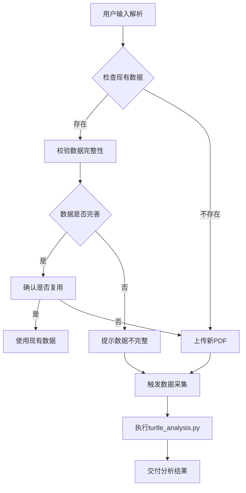

# 龟龟投资策略 v2.0 — 增强协调器（Coordinator）

> 本文件为多阶段分析的调度中枢，专为大模型设计。协调器自身不执行数据获取或分析计算，仅负责：
> (1) 解析用户输入；(2) 检查现有数据；(3) 校验数据完整性；(4) 确认用户选择；(5) 按依赖关系调度 Phase 0/1/2；(6) 交付最终结果。

---

## 输入解析

### 输入类型
用户输入可能包含以下组合：

| 输入项 | 示例 | 必需？ |
|--------|------|--------|
| 股票代码或名称 | `600989` / `宝丰能源` / `0001.HK` / `长和` | 必需 |
| 持股渠道 | `港股通` / `直接` / `美股券商` | 可选 |
| PDF 年报文件 | 用户上传的 `.pdf` 文件 | 可选 |

### 解析规则
1. 从用户消息中提取股票代码/名称和持股渠道
2. 检查是否有 PDF 文件上传（检查 `/sessions/*/mnt/uploads/` 目录中的 `.pdf` 文件）
3. 若用户只给了公司名称没给代码，通过 Tushare `stock_basic` 确认代码
4. 股票代码格式化：A 股 → `XXXXXX.SH` 或 `XXXXXX.SZ`；港股 → `XXXXX.HK`

---

## 核心工作流程



---

## 详细步骤

### 步骤 1：检查现有数据

**功能**：检查 output 目录中是否已经存在该公司的年报数据

**执行逻辑**：
1. 从用户输入中提取股票代码和公司名称
2. 构建公司目录路径：`output/{代码}_{公司名}`
3. 查找最新的年度报告目录：`output/{代码}_{公司名}/{年份}_年报`
4. 按年份降序排序，选择最新的年度报告

**示例**：
- 股票代码：`600989.SH`
- 公司名称：`宝丰能源`
- 公司目录：`output/600989SH_宝丰能源`
- 最新年报：`output/600989SH_宝丰能源/2025_年报`

### 步骤 2：校验数据完整性

**功能**：校验 `data_pack_market.md` 是否信息完善

**检查项**：
1. **文件存在性**：`data_pack_market.md` 文件是否存在
2. **关键章节**：是否包含以下章节：
   - 基本信息
   - 主营业务构成
   - 合并利润表
   - 合并资产负债表
   - 现金流量表
   - 关键财务指标
   - 股东与治理
   - 分红历史
   - 股票回购
   - 股权质押
   - 市场行情
3. **数据校验**：是否包含数据校验报告（如果使用了PDF）

**完整性评级**：
- ✅ 完整：包含所有关键章节
- ⚠️ 基本完整：缺少1-3个非核心章节
- ❌ 不完整：缺少4个以上章节或核心章节

### 步骤 3：确认用户选择

**功能**：询问用户是否复用现有数据

**触发条件**：
- 找到现有数据且数据完整或基本完整

**询问模板**：
```
现有年度报告数据已找到：
- 公司：{公司名}({股票代码})
- 年度：{年份}年
- 数据完整性：{完整/基本完整/不完整}
- 数据路径：{数据文件路径}

是否复用这些数据？

选项：
1. 是，复用现有数据
2. 否，上传新的PDF进行重新分析
```

### 步骤 4：处理PDF上传

**功能**：如果没有现有数据或用户选择上传新PDF，引导用户上传

**触发条件**：
- 未找到现有数据
- 用户选择上传新PDF

**引导模板**：
```
未找到现有年度报告数据，或您选择上传新的PDF。

请上传 {公司名} 的最新年度报告PDF文件，以便进行更全面的分析。

上传后，系统将自动执行数据采集和分析流程。
```

### 步骤 5：触发数据采集

**功能**：调用 `turtle_analysis.py` 执行基础数据采集

**执行命令**：
```bash
# 无PDF模式
python scripts/turtle_analysis.py --code {股票代码}

# 有PDF模式
python scripts/turtle_analysis.py --code {股票代码} --pdf {PDF路径}
```

**注意事项**：
- 使用优化后的PDF分析逻辑
- 确保使用最新的 `pdf_preprocessor_optimized.py`
- 并行处理Tushare数据采集和PDF分析

### 步骤 6：交付分析结果

**功能**：向用户交付分析结果

**交付内容**：
1. **分析状态**：成功/失败
2. **输出目录**：`output/{代码}_{公司名}/{年份}_年报`
3. **数据文件**：`data_pack_market.md`
4. **PDF处理结果**：`pdf_sections.json`（如果使用了PDF）
5. **状态文件**：`analysis_status.json`

**交付模板**：
```
分析完成！

📊 分析结果：
- 公司：{公司名}({股票代码})
- 年度：{年份}年
- 状态：成功

📁 输出目录：
{输出目录路径}

📄 生成文件：
- 市场数据：data_pack_market.md
- PDF分析：pdf_sections.json（如果使用了PDF）
- 分析状态：analysis_status.json

您可以查看这些文件获取详细的分析数据。
```

---

## 异常处理

| 异常情况 | 处理方式 |
|---------|----------|
| 股票代码无效 | 提示用户提供有效的股票代码 |
| 无法获取公司名称 | 使用股票代码作为目录名，继续执行 |
| PDF文件不存在 | 提示用户检查文件路径，提供正确的PDF路径 |
| PDF解析失败 | 跳过PDF分析，仅使用Tushare数据 |
| Tushare API失败 | 提示用户检查网络连接和API Token |
| 数据采集超时 | 提示用户网络可能较慢，建议稍后重试 |

---

## 文件路径约定

**变量定义**：
- `{workspace}` = 龟龟投资策略根目录
- `{output_dir}` = `{workspace}/output/{代码}_{公司}`
- `{year}` = 报告年份
- `{period}` = 报告期（年报/半年报/季报）

**文件结构**：
```
{workspace}/
├── scripts/
│   ├── turtle_analysis.py        # 数据采集主脚本
│   ├── tushare_collector.py       # Tushare数据采集
│   ├── pdf_preprocessor.py        # PDF预处理
│   ├── pdf_preprocessor_optimized.py  # 优化版PDF预处理
│   └── coordinator.py             # 协调器脚本
└── output/
    ├── 600989SH_宝丰能源/          # 公司目录
    │   ├── 2025_年报/              # 年度报告目录
    │   │   ├── data_pack_market.md     # 市场数据
    │   │   ├── pdf_sections.json       # PDF分析结果
    │   │   ├── 600989_2025_宝丰能源_年报.pdf  # PDF文件
    │   │   └── analysis_status.json    # 分析状态
    │   └── 2024_年报/              # 去年年报目录
    └── ...
```

---

## 输入输出示例

### 示例 1：有现有数据

**用户输入**：
```
分析宝丰能源的财务状况
```

**协调器处理**：
1. 提取股票代码：`600989.SH`
2. 获取公司名称：`宝丰能源`
3. 检查现有数据：`output/600989SH_宝丰能源/2025_年报`
4. 校验数据完整性：基本完整（缺少数据校验报告）
5. 询问用户：是否复用现有数据

**用户选择**：
```
是，复用现有数据
```

**协调器输出**：
```
分析完成！

📊 分析结果：
- 公司：宝丰能源(600989.SH)
- 年度：2025年
- 状态：成功

📁 输出目录：
D:\software\TRAE\projects\company_analysis\output\600989SH_宝丰能源\2025_年报

📄 生成文件：
- 市场数据：data_pack_market.md
- PDF分析：pdf_sections.json
- 分析状态：analysis_status.json

您可以查看这些文件获取详细的分析数据。
```

### 示例 2：无现有数据

**用户输入**：
```
分析伊利股份的财务状况
```

**协调器处理**：
1. 提取股票代码：`600887.SH`
2. 获取公司名称：`伊利股份`
3. 检查现有数据：未找到
4. 询问用户：是否上传PDF

**用户选择**：
```
上传PDF
```

**用户上传**：
```
伊利股份2025年年度报告.pdf
```

**协调器处理**：
1. 复制PDF到输出目录
2. 执行 `turtle_analysis.py`
3. 等待执行完成

**协调器输出**：
```
分析完成！

📊 分析结果：
- 公司：伊利股份(600887.SH)
- 年度：2025年
- 状态：成功

📁 输出目录：
D:\software\TRAE\projects\company_analysis\output\600887SH_伊利股份\2025_年报

📄 生成文件：
- 市场数据：data_pack_market.md
- PDF分析：pdf_sections.json
- 分析状态：analysis_status.json

您可以查看这些文件获取详细的分析数据。
```

---

## 总结

本协调器设计用于：
1. **提高效率**：优先复用现有数据，避免重复分析
2. **保证质量**：校验数据完整性，确保分析结果可靠
3. **用户友好**：清晰的用户交互，引导用户完成分析流程
4. **灵活性**：支持有PDF和无PDF两种分析模式
5. **可扩展性**：模块化设计，便于后续功能扩展

通过这套流程，大模型可以更加高效地处理用户的公司分析请求，提供准确、全面的分析结果。