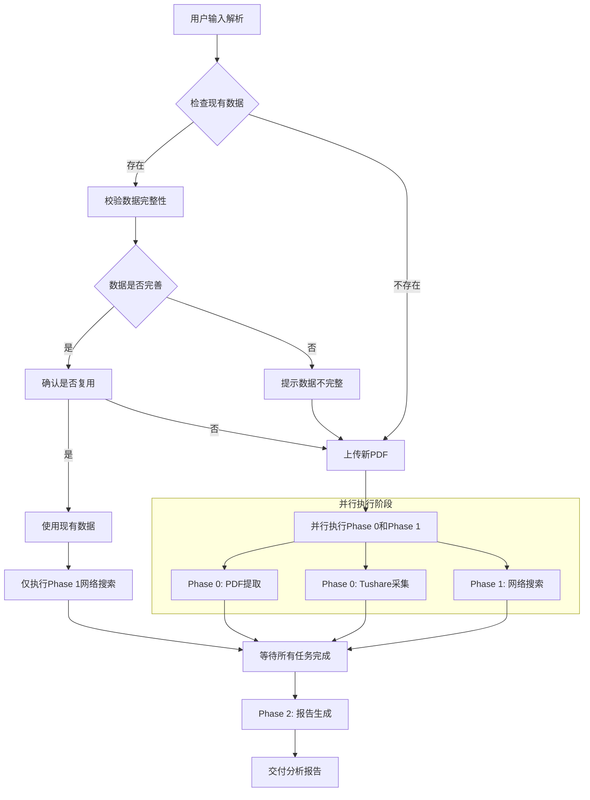

# 龟龟投资策略 v2.0 — 增强协调器（Coordinator）

> 本文件为多阶段分析的调度中枢，专为大模型设计。协调器负责调度三阶段分析流程：
>
> - **Phase 0**：数据采集（PDF提取 + Tushare财务数据，并行执行）
> - **Phase 1**：网络搜索（补充第三方信息，并行执行）
> - **Phase 2**：报告生成（整合所有数据，输出分析报告）

***

## 脚本工具总览

| 脚本                          | 用途                                          | 推荐度     |
| --------------------------- | ------------------------------------------- | ------- |
| `turtle_analysis.py`        | **一键执行数据采集**（PDF提取 + Tushare采集），支持断点续传、并行提取 | ⭐⭐⭐ 推荐  |
| `pdf_parallel_extractor.py` | 多进程PDF章节提取，支持增量提取、缓存机制                      | ⭐⭐⭐ 高性能 |
| `tushare_collector.py`      | Tushare财务数据采集                               | ⭐⭐ 基础工具 |
| `pdf_preprocessor.py`       | 基础PDF提取（顺序处理）                               | ⭐ 兼容模式  |
| `data_validator.py`         | 数据校验（PDF vs Tushare交叉验证）                    | ⭐⭐ 校验工具 |
| `config_loader.py`          | 统一配置加载（读取config.yaml）                       | 基础模块    |
| `task_status.py`            | 任务状态管理（断点续传支持）                              | 基础模块    |

**快速开始**：

```bash
# 一键执行数据采集（推荐）
python scripts/turtle_analysis.py --code 600989.SH --pdf /path/to/report.pdf

# 从断点恢复
python scripts/turtle_analysis.py --code 600989.SH --resume

# 查看任务状态
python scripts/turtle_analysis.py --code 600989.SH --status
```

***

## 核心工作流程



**关键优化**：

- **Phase 0 和 Phase 1 并行执行**：数据采集（PDF提取 + Tushare）和网络搜索同时进行，提升效率
- **等待机制**：所有并行任务完成后，才进入 Phase 2 报告生成阶段
- **复用场景优化**：若用户选择复用现有数据，仅需执行 Phase 1 网络搜索

***

## 并行执行策略

### 为什么并行执行？

**Phase 0（数据采集）和Phase 1（网络搜索）互不依赖**，可以同时执行：

| 阶段      | 任务                | 依赖项 | 输出                                          |
| ------- | ----------------- | --- | ------------------------------------------- |
| Phase 0 | PDF提取 + Tushare采集 | 无   | `data_pack_market.md` + `pdf_sections.json` |
| Phase 1 | 网络搜索              | 无   | `web_search_result.md`                      |

**并行优势**：

- 减少总执行时间约40-50%
- 网络搜索和API调用可同时进行
- 用户等待时间更短

### 并行执行方式

**方式一：大模型内部并行**

- 在同一响应中同时执行多个搜索和数据提取任务
- 适用于：网络搜索、PDF文本提取

**方式二：脚本并行执行**

```bash
# 终端1：数据采集（Phase 0）
python scripts/turtle_analysis.py --code 600989.SH --pdf {PDF路径}

# 终端2：网络搜索（Phase 1）- 由大模型执行
# 大模型同时进行网络搜索
```

**方式三：复用现有数据时**

- 若用户选择复用现有数据，跳过Phase 0
- 仅执行Phase 1（网络搜索）

***

## 前置步骤：配置校验

### 步骤0：配置一致性校验

**功能**：确保所有配置文件与统一配置文件 `config/analysis_modules.yaml` 保持一致

**执行脚本**：
```bash
python scripts/validate_config.py
```

**校验项**：
- [ ] pdf_config.py 章节配置是否与统一配置一致
- [ ] coordinator_v2.md 搜索项是否与统一配置一致
- [ ] pdf_parser.md 章节定义是否与统一配置一致
- [ ] report_template.md 章节结构是否与统一配置一致

**校验结果处理**：
- ✅ 校验通过：继续执行后续步骤
- ❌ 校验失败：运行 `python scripts/generate_config.py` 重新生成配置文件

**配置文件架构**：
```
config/analysis_modules.yaml  ← 单一真相来源（唯一需要修改的文件）
        ↓
scripts/generate_config.py    ← 自动生成脚本
        ↓
scripts/pdf_config.py         ← 自动生成（只读）
prompts/coordinator_v2.md     ← 引用 websearch_guidelines.md
prompts/websearch_guidelines.md ← 包含所有网络搜索规范
```

**新增模块流程**：
1. 修改 `config/analysis_modules.yaml`
2. 运行 `python scripts/generate_config.py`
3. 运行 `python scripts/validate_config.py` 校验

***

## 前置步骤：输入解析与数据检查

### 步骤1：输入解析

**用户输入可能包含以下组合**：

| 输入项      | 示例                                   | 必需？ |
| -------- | ------------------------------------ | --- |
| 股票代码或名称  | `600989` / `宝丰能源` / `0001.HK` / `长和` | 必需  |
| 持股渠道     | `港股通` / `直接` / `美股券商`                | 可选  |
| PDF 年报文件 | 用户上传的 `.pdf` 文件或本地路径                 | 可选  |

**解析规则**：

1. 从用户消息中提取股票代码/名称和持股渠道
2. 检查是否有 PDF 文件上传或本地路径
3. 若用户只给了公司名称没给代码，通过 Tushare `stock_basic` 确认代码
4. 股票代码格式化：A 股 → `XXXXXX.SH` 或 `XXXXXX.SZ`；港股 → `XXXXX.HK`

**解析结果示例**：

| 项目   | 值                              |
| ---- | ------------------------------ |
| 股票代码 | 600989.SH                      |
| 公司名称 | 宝丰能源                           |
| 报告年份 | 2025                           |
| 报告期  | 年报                             |
| 输出目录 | output/600989SH\_宝丰能源/2025\_年报 |

### 步骤2：检查现有数据

**功能**：检查 output 目录中是否已经存在该公司的年报数据

**执行逻辑**：

1. 从用户输入中提取股票代码和公司名称
2. 构建公司目录路径：`output/{代码}_{公司名}`
3. 查找最新的年度报告目录：`output/{代码}_{公司名}/{年份}_年报`
4. 按年份降序排序，选择最新的年度报告

**检查项**：

- [ ] 公司目录是否存在
- [ ] 最新年报目录是否存在
- [ ] `data_pack_market.md` 是否存在
- [ ] `pdf_sections.json` 是否存在
- [ ] `web_search_result.md` 是否存在
- [ ] 分析报告是否已生成

### 步骤3：校验数据完整性

**功能**：校验 `data_pack_market.md` 是否信息完善

**检查项**：

1. **文件存在性**：`data_pack_market.md` 文件是否存在
2. **关键章节**：是否包含以下章节：
   - §1 基本信息
   - §3 合并利润表
   - §4 合并资产负债表
   - §5 现金流量表
   - §9 主营业务构成
   - §12 关键财务指标
3. **数据校验**：是否包含近3年数据

**完整性评级**：

- ✅ 完整：包含所有关键章节，近3年数据完整
- ⚠️ 基本完整：缺少1-3个非核心章节
- ❌ 不完整：缺少4个以上章节或核心章节

### 步骤4：确认用户选择

**功能**：询问用户是否复用现有数据

**触发条件**：

- 找到现有数据且数据完整或基本完整

**询问模板**：

```
📊 现有年度报告数据已找到：
- 公司：{公司名}({股票代码})
- 年度：{年份}年
- 数据完整性：{完整/基本完整/不完整}
- 数据路径：{数据文件路径}

是否复用这些数据？

选项：
1. ✅ 是，复用现有数据（跳过Phase 0，直接执行Phase 1）
2. ❌ 否，重新采集数据（执行完整流程）
```

### 步骤5：处理PDF文件

**情况A：用户已提供PDF**

- 检查PDF文件是否存在
- 复制到输出目录：`{output_dir}/{code}_{year}_{公司名}_年报.pdf`

**情况B：用户未提供PDF**

- 询问用户是否有本地PDF文件

**询问模板**：

```
📄 未检测到PDF年报文件。

请选择：
1. 📤 上传PDF年报文件
2. 📁 提供本地PDF路径（如：D:\Reports\600989_2025_年报.pdf）
3. ⏭️ 跳过PDF提取（仅使用Tushare财务数据）

提示：PDF年报可提供更丰富的文本信息（核心竞争力、风险因素、未来规划等）
```

**用户响应处理**：

- 选择1：等待用户上传文件
- 选择2：等待用户提供路径，验证文件是否存在
- 选择3：跳过PDF提取，仅执行Tushare数据采集

***

## Phase 0：数据采集阶段

### ⚠️ 重要：统一执行规范

**必须使用 `turtle_analysis.py` 统一执行 Phase 0，禁止手动分步执行子脚本！**

**原因**：
1. `turtle_analysis.py` 会自动复制PDF到输出目录并规范命名
2. `turtle_analysis.py` 会同时执行PDF提取和Tushare采集
3. `turtle_analysis.py` 支持断点续传和状态管理

### 执行逻辑

**Phase 0 和 Phase 1 并行执行**：

**并行任务清单**：

| 任务        | 输入                 | 输出      | 说明                     |
| --------- | ------------------ | ------- | ---------------------- |
| Phase 0-A: PDF年报提取 | PDF文件路径 | `pdf_sections.json` + 原始PDF复制 | 提取A股年报标准章节，复制原始PDF到输出目录 |
| Phase 0-B: Tushare财务数据采集 | 股票代码 | `data_pack_market.md` | 采集财务数据 |
| Phase 1   | 网络搜索 | 公司名/行业名 | `web_search_result.md` | 搜索行业/公司/竞争信息 |

**等待机制**：

- 所有并行任务完成后，才进入 Phase 2 报告生成阶段
- 若任一任务失败，记录错误但继续执行其他任务
- 最终报告生成时，标注缺失的数据项

### 统一执行命令（必须执行）

**⚠️ 以下命令必须执行，禁止跳过！**

```bash
# 一键执行 Phase 0（PDF复制 + PDF提取 + Tushare采集）
python scripts/turtle_analysis.py --code {code} --pdf {PDF路径} --parallel --workers 4
```

**示例**：
```bash
# 宏桥控股分析
python scripts/turtle_analysis.py --code 002379.SZ --pdf "D:\book\财报\宏桥控股\宏桥控股：2025年年度报告.pdf" --parallel --workers 4
```

**输出文件**：
- `{code}_{year}_{公司名}_年报.pdf`：原始PDF文件（自动复制并规范命名）
- `pdf_sections.json`：章节文本提取结果
- `pdf_sections.md`：可读版本（可选）
- `data_pack_market.md`：财务数据包

### PDF提取规范（必须遵循）

**⚠️ 严格按照 `prompts/pdf_parser.md` 规范执行PDF提取**

**核心规则**：
1. 两阶段提取：阶段一提取章节文本 → 阶段二精提取结构化数据
2. 章节清单：详见 `pdf_parser.md` 第一章节
3. 输出格式：严格按照 `pdf_parser.md` 的输出规范

**执行步骤**：
1. 读取 `prompts/pdf_parser.md` 获取完整提取规范
2. 执行脚本提取章节文本
3. 输出 `pdf_sections.json` 和 `data_pack_report.md`

**校验要求**：
- 关键章节（BIZ, MDA_INDUSTRY, MDA_OPERATION）不能为空
- 精提取数据至少包含3项（P3, P5, P13）

### Phase 0 输出校验（必须执行）

**校验步骤**：
1. 检查原始PDF是否已复制到输出目录
2. 检查 `pdf_sections.json` 是否存在
3. 检查 `data_pack_market.md` 是否存在

**校验命令**：
```bash
# 查看输出目录文件列表
ls {output_dir}
```

**校验项**：

| 文件 | 必需 | 校验规则 |
|------|------|---------|
| `{code}_{year}_{公司名}_年报.pdf` | ✅ 必需 | 原始PDF必须复制到输出目录 |
| `data_pack_market.md` | ✅ 必需 | 至少包含 §1, §3, §4, §5, §9, §12 章节 |
| `pdf_sections.json` | ✅ 必需 | 关键章节 BIZ, MDA_INDUSTRY, MDA_OPERATION 不能为空 |

**校验结果处理**：

- ✅ 完整：进入 Phase 1
- ⚠️ 部分缺失：补充执行缺失的任务
- ❌ 严重缺失：提示用户检查数据源

**数据包章节清单**：

| 章节标识 | 章节名称    | 核心用途            |
| ---- | ------- | --------------- |
| §1   | 基本信息    | 行业分类、PE/PB、市值   |
| §3   | 合并利润表   | 营收、净利润、费用       |
| §4   | 合并资产负债表 | 资产结构、负债结构、话语权指标 |
| §5   | 现金流量表   | 经营/投资/筹资现金流     |
| §9   | 主营业务构成  | 分产品营收/毛利        |
| §12  | 关键财务指标  | ROE、毛利率、周转率     |

***

## Phase 1：网络搜索阶段

### 执行规范

**⚠️ 严格按照 `prompts/websearch_guidelines.md` 规范执行网络搜索**

**核心规则**：
1. 年份动态处理：`{最新年份}` 替换为当前实际年份（从 `<env>` 获取）
2. 搜索项优先级：第一优先级必须执行，第二/三优先级根据行业类型选择
3. 搜索结果格式：严格按照 `websearch_guidelines.md` 的输出格式规范

### 搜索项清单（必须逐项执行）

#### 第一优先级（必须全部执行）

| 序号 | 搜索模块 | 搜索关键词模板 | 必查内容 |
|------|---------|---------------|---------|
| 1.1 | 核心主营业务与商业模式 | `"{公司名} {细分赛道} 商业模式 成本优势 {最新年份}"` | 主营业务构成、盈利模式、客户类型、资产属性、三类话语权 |
| 1.2 | 所属细分赛道与行业属性 | `"{细分赛道名} 行业生命周期 市场规模 {最新年份}"` | 行业分类、行业属性、生命周期、行业规模 |
| 1.3 | 竞争格局与行业地位 | `"{公司名} 市场份额 行业排名 {最新年份}"` | 市场占有率、竞争对手、行业集中度、核心优势 |
| 1.4 | 分析目标锚定 | `"{公司名} 机构持仓 券商评级 目标价 {最新年份}"` | 机构评级、目标价、投资逻辑、风险点 |
| 2.1 | 审计意见核查 | `"{公司名} 审计机构 审计意见 {最新年份}年报"` | 审计意见类型、审计机构、连续审计年限 |
| 2.2 | 会计政策一致性核查 | `"{公司名} 会计政策变更 交易所公告 {最新年份}"` | 会计政策变更、变更影响、行业对标 |
| 2.3 | 异常数据初筛 | `"{细分赛道名} 同市值规模 营收增速 毛利率 平均水平 {最新年份}"` | 大存大贷、盈利质量、关联交易异常 |
| 2.5 | 管理层治理能力与治理风险 | `"{公司名} 证监会 行政处罚 问询函 {最新3年}"` | 监管处罚、管理层稳定性、内控有效性、关联交易合规 |

#### 第二优先级（根据行业类型选择）

| 序号 | 搜索模块 | 适用行业 | 搜索关键词模板 |
|------|---------|---------|---------------|
| 3.1 | 行业政策与监管 | 全行业 | `"{行业名} 政策 监管 十四五规划 {最新年份}"` |
| 3.2 | 行业技术与发展趋势 | 全行业 | `"{行业名} 技术趋势 发展趋势 {最新年份}"` |
| 3.3 | 行业供需与价格 | 周期行业 | `"{行业名} 供需 价格走势 产能 {最新年份}"` |
| 4.1 | 资产负债表行业对标 | 全行业 | `"{细分赛道名} 资产负债率 流动比率 行业平均 {最新年份}"` |
| 4.2 | 利润表行业对标 | 全行业 | `"{细分赛道名} 毛利率 净利率 行业平均 {最新年份}"` |
| 4.3 | 现金流量表行业对标 | 全行业 | `"{细分赛道名} 盈利现金比率 行业平均 {最新年份}"` |
| 4.4 | 杜邦分析行业对标 | 全行业 | `"{细分赛道名} ROE 净利率 周转率 行业平均 {最新年份}"` |

#### 第三优先级（根据分析需要选择）

| 序号 | 搜索模块 | 搜索关键词模板 |
|------|---------|---------------|
| 5.1 | 公司治理与管理层 | `"{公司名} 管理层 董事长 股权结构 {最新年份}"` |
| 5.2 | 公司战略与规划 | `"{公司名} 发展战略 产能扩张 {最新年份}"` |
| 5.3 | 公司风险与争议 | `"{公司名} 风险 争议 处罚 诉讼 {最新年份}"` |
| 6.1 | 周期行业分析 | `"{细分赛道名} 周期位置 成本曲线 供需缺口 {最新年份}"` |
| 6.2 | 消费行业分析 | `"{公司名} 品牌价值 渠道占比 复购率 {最新年份}"` |
| 6.3 | 医药行业分析 | `"{公司名} 研发管线 集采中标 专利到期 {最新年份}"` |
| 7.1 | 同业对比分析 | `"{公司名} vs {竞争对手名} 毛利率 ROE {最新年份}"` |
| 8.1 | 风险识别 | `"{公司名} 债务风险 经营风险 政策风险 {最新年份}"` |
| 9.1 | 估值方法选择 | `"{细分赛道名} 估值方法 PE PB DCF 适用 {最新年份}"` |

### 执行步骤

1. **执行前**：根据公司行业类型，列出本次需要执行的搜索项清单
2. **执行中**：按优先级顺序逐项执行搜索，记录每项搜索结果
3. **执行后**：填写搜索项完成率校验表

### 搜索项完成率校验表（必须填写）

| 优先级 | 应执行项数 | 实际完成项数 | 完成率 | 是否达标 |
|--------|-----------|-------------|--------|---------|
| 第一优先级 | 7 | {实际完成数} | {完成率}% | ≥90% ✅/❌ |
| 第二优先级 | {应执行数} | {实际完成数} | {完成率}% | ≥80% ✅/❌ |
| 第三优先级 | {应执行数} | {实际完成数} | {完成率}% | ≥60% ✅/❌ |

**校验要求**：
- 第一优先级搜索项完成率 ≥ 90%（必须达标）
- 第二优先级搜索项完成率 ≥ 80%
- 第三优先级搜索项完成率 ≥ 60%
- 每项搜索需标注信息来源和质量评级

**输出文件**：`{output_dir}/web_search_result.md`

**输出格式要求**：
```markdown
# {公司名}（{股票代码}）网络搜索结果

> **搜索时间**：{YYYY-MM-DD}
> **搜索规范**：`prompts/websearch_guidelines.md`

---

## 搜索项完成率校验表

| 优先级 | 应执行项数 | 实际完成项数 | 完成率 | 是否达标 |
|--------|-----------|-------------|--------|---------|
| 第一优先级 | 7 | {实际完成数} | {完成率}% | ≥90% ✅/❌ |
| 第二优先级 | {应执行数} | {实际完成数} | {完成率}% | ≥80% ✅/❌ |
| 第三优先级 | {应执行数} | {实际完成数} | {完成率}% | ≥60% ✅/❌ |

---

## 搜索结果正文
{按 websearch_guidelines.md 格式输出各搜索项结果}
```

***

## Phase 2：报告生成阶段

### 执行前检查（必须执行）

**⚠️ 检查 `web_search_result.md` 中的搜索项完成率校验表**

**检查步骤**：
1. 读取 `{output_dir}/web_search_result.md`
2. 检查"搜索项完成率校验表"是否存在
3. 检查第一优先级完成率是否 ≥ 90%
4. 若不达标，返回 Phase 1 补充执行缺失的搜索项

5. 若达标，继续执行报告生成

**检查清单**：
- [ ] web_search_result.md 文件存在
- [ ] 搜索项完成率校验表存在
- [ ] 第一优先级完成率 ≥ 90%
- [ ] 第二优先级完成率 ≥ 80%（如有）

### 执行逻辑

**输入文件**：

1. `prompts/report_template.md`：报告模板
2. `data_pack_market.md`：财务数据
3. `pdf_sections.json`：PDF提取内容
4. `web_search_result.md`：网络搜索结果

**参考文件**：

- `plan.md`：分析框架
- **`prompts/report_template.md`：报告模板（必须严格遵循）**

### 报告模板要求

> ⚠️ **重要**：报告生成必须严格遵循 `prompts/report_template.md` 的章节结构和格式要求。

**模板核心结构**：

| 章节 | 内容要求 | 数据来源标注 |
|------|---------|-------------|
| 第一部分 | 分析前置准备与财报真实性校验 | 每项标注来源+状态 |
| ├─ 1.1 | 核心主营业务与商业模式（必填信息表） | `data_pack§9`、`pdf_sections[BIZ]` |
| ├─ 1.2 | 所属细分赛道与行业属性（必填信息表） | `data_pack§1`、网络搜索 |
| ├─ 1.3 | 竞争格局与行业地位（必填信息表） | 网络搜索、`pdf_sections[MDA_INDUSTRY]` |
| ├─ 1.4 | 分析目标锚定（必填信息表） | 网络搜索、`pdf_sections[MDA_OUTLOOK]` |
| └─ 2.x | 财报真实性与数据质量校验 | `data_pack§7`、`pdf_sections[AUDIT]` |
| 第二部分 | 核心财务三维度深度分析 | 每项标注来源+状态 |
| ├─ 模块1 | 资产负债表分析（详细表格） | `data_pack§4`、`pdf_sections[DEBT/INV/AR]` |
| ├─ 模块2 | 利润表分析（详细表格） | `data_pack§3` |
| ├─ 模块3 | 现金流量表分析（详细表格） | `data_pack§5` |
| └─ 模块4 | 杜邦分析体系 | `data_pack§12` |
| 第三部分 | 分行业差异化分析框架 | 根据行业类型选择 |
| 第四部分 | 同业对标与护城河验证 | 网络搜索、`data_pack§17` |
| 第五部分 | 风险识别与敏感性分析 | `pdf_sections[MDA_RISK]`、`data_pack§13` |
| 第六部分 | 估值与价值判断 | `data_pack§17.8/17.9` |
| 第七部分 | 动态跟踪体系搭建 | 网络搜索 |
| 附录 | 数据来源、信息质量评级 | 汇总所有来源 |

**必填信息表格式**：

```markdown
**必填信息表**：
| 信息项 | 数据来源 | 当前状态 | 具体内容 | 数据校验规则 |
|--------|----------|----------|----------|--------------|
| 主营业务构成 | data_pack§9 | ✅/⚠️ | [各产品营收占比] | 各产品占比加总=100% |
```

**数据获取失败提示格式**：

```markdown
**数据获取失败提示**（如有）：
⚠️ 数据获取失败：{具体数据项名称}
- 尝试来源：{data_pack_market.md §X / pdf_sections.json [章节名]}
- 失败原因：{数据不存在/章节未找到/格式异常}
- 替代方案：{网络搜索/人工确认}
```

**分析结论格式**：

```markdown
**分析结论**：
- 商业模式本质：[结合产业链、资产属性、客户属性、三类话语权的精准描述]
- 盈利核心驱动：[结合产品结构、价差、产能、话语权的核心驱动因素]
- **产业链话语权总结**：
  - 上游话语权：[强/中/弱，补充量化依据与行业对标结果]
  - 下游话语权：[强/中/弱，补充量化依据与行业对标结果]
  - 政府话语权：[强/中/弱，补充政策适配度与资源获取能力判断]
```

### 报告生成规则

#### 规则0：模板严格遵循（最重要）

> ⚠️ **关键要求**：报告生成必须**逐字逐句**遵循 `prompts/report_template.md` 的结构，不得遗漏任何章节或表格。

**强制要求**：
1. **章节结构**：必须包含模板中的所有7个部分（第一部分至第七部分+附录）
2. **必填信息表**：每个子章节的"必填信息表"必须完整填写，格式严格遵循模板
3. **数据来源标注**：每项数据必须标注来源（`data_pack§X`、`pdf_sections[章节名]`、`网络搜索`）
4. **状态标注**：每项数据必须标注状态（✅/⚠️/❌）
5. **数据校验规则**：每项数据必须填写校验规则列
6. **分析结论**：每个子章节必须有"分析结论"部分，格式遵循模板
7. **数据获取失败提示**：如有数据获取失败，必须按模板格式显示

**禁止行为**：
- ❌ 不得省略模板中的任何章节
- ❌ 不得简化"必填信息表"格式
- ❌ 不得遗漏数据来源标注
- ❌ 不得遗漏数据校验规则列

#### 规则1：数据优先级

| 数据来源                   | 优先级 | 说明           |
| ---------------------- | --- | ------------ |
| data\_pack\_market.md  | 最高  | 财务数据，精确可验证   |
| pdf\_sections.json     | 高   | 公司官方披露，权威    |
| web\_search\_result.md | 中   | 第三方信息，需交叉验证  |
| 默认值/推断                 | 低   | 仅在无数据时使用，需标注 |

#### 规则2：数据获取失败处理

当无法从任何来源获取数据时，在报告中显示：

```
⚠️ 数据获取失败：{具体数据项名称}
- 尝试来源：{data_pack_market.md §X / pdf_sections.json [章节名] / web_search_result.md}
- 失败原因：{数据不存在/章节未找到/格式异常/搜索无结果}
- 替代方案：{网络搜索/人工确认}
```

#### 规则3：交叉验证标注

当多个来源数据不一致时，标注：

```
⚠️ 数据交叉验证差异：
- 来源A（{data_pack/pdf/web}）：{数值A}
- 来源B（{data_pack/pdf/web}）：{数值B}
- 采用值：{数值}，采用原因：{说明}
```

#### 规则4：状态标注规范

| 状态标注 | 含义            |
| ---- | ------------- |
| ✅    | 数据已获取并验证      |
| ⚠️   | 数据待提取/待计算/待确认 |
| 🔍   | 数据待网络搜索       |
| ⚙️   | 数据待计算         |
| ❌    | 数据获取失败        |

### 报告输出路径

**输出文件**：`{output_dir}/{year}_{period}/{code}_{year}_{公司名}_分析报告.md`

**示例**：

```
output/600989SH_宝丰能源/2025_年报/600989_2025_宝丰能源_分析报告.md
```

### 报告生成后校验（必须执行）

**⚠️ 报告生成完成后，必须执行以下校验**

#### 校验步骤

1. **读取模板目录结构**：读取 `prompts/report_template.md`，提取所有 `##`、`###`、`####` 级别的标题
2. **检查生成的报告**：逐项检查这些标题是否在生成的报告中存在
3. **输出校验结果**：列出缺失的章节，若无缺失则标注通过

#### 校验报告格式

```markdown
## 报告生成后校验结果

### 校验方式
对比 `prompts/report_template.md` 模板目录结构，检查生成报告的章节完整性。

### 校验结果
| 章节 | 是否存在 | 状态 |
|------|---------|------|
| ## 第一部分 分析前置准备与财报真实性校验 | ✅ | 完整 |
| #### 1.1 核心主营业务与商业模式 | ✅ | 完整 |
| ... | ... | ... |
| ## 第七部分 动态跟踪体系搭建 | ✅ | 完整 |

### 校验结论
✅ 报告校验通过，所有模板章节均已生成。
```

#### 校验结果处理

| 校验结果 | 处理方式 |
|---------|---------|
| 全部通过 | 标注"✅ 报告校验通过"，结束任务 |
| 章节缺失 | 补充缺失章节内容 |

***

## 完整执行流程示例

### 示例1：有现有数据，用户选择复用

**用户输入**：

```
分析宝丰能源的财务状况
```

**步骤1：输入解析**

| 项目   | 值                              |
| ---- | ------------------------------ |
| 股票代码 | 600989.SH                      |
| 公司名称 | 宝丰能源                           |
| 报告年份 | 2025                           |
| 报告期  | 年报                             |
| 输出目录 | output/600989SH\_宝丰能源/2025\_年报 |

**步骤2：检查现有数据**

- [x] 公司目录存在：`output/600989SH_宝丰能源`
- [x] 年报目录存在：`2025_年报`
- [x] `data_pack_market.md` 存在
- [x] `pdf_sections.json` 存在
- [ ] `web_search_result.md` 不存在
- [ ] 分析报告未生成

**步骤3：校验数据完整性**

- 结果：✅ 完整（包含所有关键章节）

**步骤4：确认用户选择**

```
📊 现有年度报告数据已找到：
- 公司：宝丰能源(600989.SH)
- 年度：2025年
- 数据完整性：完整
- 数据路径：output/600989SH_宝丰能源/2025_年报

是否复用这些数据？

选项：
1. ✅ 是，复用现有数据（跳过Phase 0，直接执行Phase 1）
2. ❌ 否，重新采集数据（执行完整流程）
```

**用户选择**：

```
1，复用现有数据
```

**执行Phase 1**：网络搜索 → 生成 `web_search_result.md`

**执行Phase 2**：报告生成 → 生成 `600989_2025_宝丰能源_分析报告.md`

**交付结果**：

```
✅ 分析完成！

📊 分析结果：
- 公司：宝丰能源(600989.SH)
- 年度：2025年
- 状态：成功

📁 输出目录：
output/600989SH_宝丰能源/2025_年报

📄 生成文件：
├── data_pack_market.md      # 财务数据包（复用）
├── pdf_sections.json        # PDF提取结果（复用）
├── web_search_result.md     # 网络搜索结果（新生成）
└── 600989_2025_宝丰能源_分析报告.md  # 最终分析报告（新生成）
```

***

### 示例2：无现有数据，用户提供PDF路径

**用户输入**：

```
分析伊利股份的财务状况
PDF路径：D:\Reports\伊利股份2025年年度报告.pdf
```

**步骤1：输入解析**

| 项目    | 值                              |
| ----- | ------------------------------ |
| 股票代码  | 600887.SH                      |
| 公司名称  | 伊利股份                           |
| 报告年份  | 2025                           |
| 报告期   | 年报                             |
| PDF路径 | D:\Reports\伊利股份2025年年度报告.pdf   |
| 输出目录  | output/600887SH\_伊利股份/2025\_年报 |

**步骤2：检查现有数据**

- [ ] 公司目录不存在
- 结果：无现有数据

**步骤5：处理PDF文件**

- 验证PDF路径存在
- 复制到输出目录

**执行Phase 0 和 Phase 1（并行执行）**：

**并行任务**：

```bash
# 终端1：PDF提取
python scripts/pdf_preprocessor.py --pdf {PDF路径} --output {output_dir}

# 终端2：Tushare数据采集
python scripts/tushare_collector.py --code 600887.SH --output {output_dir}

# 终端3：网络搜索（并行执行）
# 按 websearch_guidelines.md 定义的搜索任务执行
# 输出到 web_search_result.md
```

**等待完成**：所有并行任务完成后，校验输出文件：

- `data_pack_market.md` ✅
- `pdf_sections.json` ✅
- `web_search_result.md` ✅

**执行Phase 2**：报告生成 → `600887_2025_伊利股份_分析报告.md`

**交付结果**：

```
✅ 分析完成！

📊 分析结果：
- 公司：伊利股份(600887.SH)
- 年度：2025年
- 状态：成功

📁 输出目录：
output/600887SH_伊利股份/2025_年报

📄 生成文件：
├── 600887_2025_伊利股份_年报.pdf      # 原始PDF
├── data_pack_market.md               # 财务数据包
├── pdf_sections.json                 # PDF提取结果
├── web_search_result.md              # 网络搜索结果
└── 600887_2025_伊利股份_分析报告.md   # 最终分析报告
```

***

### 示例3：无现有数据，用户选择跳过PDF

**用户输入**：

```
分析中国平安的财务状况
```

**步骤1：输入解析**

| 项目   | 值                              |
| ---- | ------------------------------ |
| 股票代码 | 601318.SH                      |
| 公司名称 | 中国平安                           |
| 报告年份 | 2025                           |
| 报告期  | 年报                             |
| 输出目录 | output/601318SH\_中国平安/2025\_年报 |

**步骤2：检查现有数据**

- [ ] 公司目录不存在
- 结果：无现有数据

**步骤5：处理PDF文件**

```
📄 未检测到PDF年报文件。

请选择：
1. 📤 上传PDF年报文件
2. 📁 提供本地PDF路径
3. ⏭️ 跳过PDF提取（仅使用Tushare财务数据）

提示：PDF年报可提供更丰富的文本信息（核心竞争力、风险因素、未来规划等）
```

**用户选择**：

```
3，跳过PDF提取
```

**执行Phase 0**：

- 任务A：跳过（无PDF）
- 任务B：Tushare采集 → `data_pack_market.md`

**执行Phase 1**：网络搜索 → `web_search_result.md`

**执行Phase 2**：报告生成（部分字段标注「⚠️ 待提取」）

**交付结果**：

```
✅ 分析完成！

📊 分析结果：
- 公司：中国平安(601318.SH)
- 年度：2025年
- 状态：成功（部分数据缺失）

📁 输出目录：
output/601318SH_中国平安/2025_年报

📄 生成文件：
├── data_pack_market.md               # 财务数据包
├── web_search_result.md              # 网络搜索结果
└── 601318_2025_中国平安_分析报告.md   # 最终分析报告

⚠️ 注意：未提供PDF年报，以下信息缺失：
- 核心竞争力描述
- 风险因素详情
- 未来发展规划
```

***

## 文件路径约定

**变量定义**：

- `{workspace}` = `d:\software\TRAE\projects\company_analysis`
- `{code}` = 股票代码（如 `600989SH`）
- `{company}` = 公司简称（如 `宝丰能源`）
- `{year}` = 报告年份（如 `2025`）
- `{period}` = 报告期（如 `年报`）
- `{output_dir}` = `{workspace}/output/{code}_{company}/{year}_{period}`

**完整目录结构**：

```
{workspace}/
├── prompts/
│   ├── coordinator_v2.md        # 本协调器文档
│   ├── plan.md                  # 分析框架
│   ├── report_template.md       # 报告模板
│   └── websearch_guidelines.md  # 网络搜索规范
├── scripts/
│   ├── tushare_collector.py     # Tushare数据采集
│   ├── pdf_preprocessor.py      # PDF预处理
│   └── turtle_analysis.py       # 分析主脚本
└── output/
    └── 600989SH_宝丰能源/
        └── 2025_年报/
            ├── 600989_2025_宝丰能源_年报.pdf      # 原始PDF
            ├── data_pack_market.md               # 财务数据包
            ├── pdf_sections.json                 # PDF提取结果
            ├── web_search_result.md              # 网络搜索结果
            ├── analysis_status.json              # 分析状态
            └── 600989_2025_宝丰能源_分析报告.md   # 最终报告
```

***

## 异常处理

| 异常情况          | 处理方式                 |
| ------------- | -------------------- |
| 股票代码无效        | 提示用户提供有效的股票代码        |
| PDF文件不存在      | 跳过PDF提取，仅使用Tushare数据 |
| PDF解析失败       | 记录错误日志，继续执行其他任务      |
| Tushare API失败 | 提示用户检查网络和API Token   |
| 网络搜索无结果       | 标注为「待确认」，使用财报数据替代    |
| 数据交叉验证冲突      | 标注冲突，采用优先级高的来源       |

***

## 总结

本协调器设计用于：

1. **三阶段流程**：数据采集 → 网络搜索 → 报告生成
2. **并行执行**：Phase 0 内PDF提取和Tushare采集并行
3. **数据完整性**：多来源交叉验证，缺失数据明确标注
4. **可追溯性**：所有数据来源、搜索结果均有记录
5. **灵活性**：支持部分数据缺失情况下的分析执行

通过这套流程，大模型可以系统化地执行公司深度分析，输出完整、可验证的分析报告。
